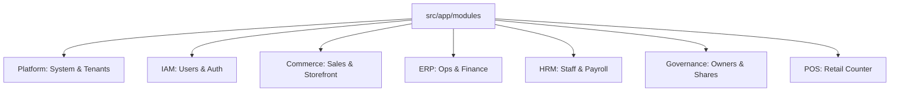

# Module Map & Architecture Guide 🗺️

This guide helps developers navigate the backend structure (`src/app/modules`).

## 🏢 Core Hierarchy

## 📂 Directory Reference

### 1. Platform (`/platform`)
**"The SaaS Engine"**
- `organization/`: Tenants (`company`) and Business Units (`business-unit`).
    - `company/settings`: **Tenant Config** (Branding, Tax).
    - `business-unit/settings`: **BU Config** (Master Configuration).
        - `pos/`: Counter & Receipt settings.
        - `finance/`: Tax & Payment.
        - `commerce/`: Shipping & Checkout.
        - `hrm/`: Attendance & Payroll.
        - `general/`: Other Configurations.
    - `outlet/settings`: **Outlet Config** (POS Counters).
- `settings/system-settings`: **Global Config** (Currency, Languages).
- `license/`: Subscription tracking.
- `package/`: SaaS Plans.

### 2. IAM (`/iam`)
**"Identity & Access"**
- `user/`: Central User entity.
- `role/`: RBAC definitions.
- `index.ts`: Public API for IAM.

### 3. ERP (`/erp`)
**"Back Office"**
- `inventory/`: Stock & Warehouses.
- `accounting/`: Ledgers & Transactions.
- `purchase/`: Suppliers & Procurement.
- `index.ts`: Public API for ERP.

### 4. Commerce (`/commerce`)
**"Sales Engine"**
- `catalog/`: Products, Categories, Brands.
- `sales/`: Orders, Invoices.
- `storefront/`: Public website data.
- `index.ts`: Public API for Commerce.

### 5. POS (`/pos`)
**"Retail Frontend Support"**
- `cash/`: Shift management & Petty cash.
- `index.ts`: Public API for POS.

## 🛑 Key Architecture Rules

1.  **Strict Module Boundaries**:
    - Do NOT import internal files from other modules.
    - ALWAYS import from the Module Barrel (e.g., `import ... from '@app/modules/erp'`).

2.  **Settings Hierarchy**:
    - **Global**: `Platform > Settings > SystemSettings`
    - **Company**: `Platform > Org > Company > Settings`
    - **Outlet**: `Platform > Org > Outlet > Settings`

3.  **License Enforcement**:
    - Use `RequireModule('moduleName')` middleware for all paid features.

---
*Generated for Onboarding - 2026*
