# 🌌 Zenith Multi-Tenancy Architecture

## 📜 Overview
This document outlines the "industrial standard" multi-tenancy and context-aware isolation layer implemented in the **Signature Bangla POS** ecosystem. The system is designed for **Zero Trust**, ensuring that data isolation is enforced at the architectural level (Mongoose Plugins + Context Service) rather than relying on developer discipline.

---

## 🏗️ Core Hierarchy
The system operates on a 4-layer hierarchy. Access is strictly downward; a node can see its children but never its parent or siblings.

```mermaid
graph TD
    ROOT["🌐 PLATFORM (Super Admin)"]
    ORG["🏢 COMPANY (Merchant/Organization)"]
    UNIT["🏬 BUSINESS UNIT (Branch/Warehouse)"]
    OUTLET["🛒 OUTLET (POS Terminal/Store)"]

    ROOT --> ORG
    ORG --> UNIT
    UNIT --> OUTLET
```

---

## 🔐 Security Principles (Zero Trust)

### 1. Context-Driven filtering
Every request is intercepted by the `auth` middleware, which extracts/validates the context header and populates the `ContextService` (powered by `AsyncLocalStorage`). 
- **Identity != Access:** A user's identity is global, but their access is bounded to a specific `ContextNode`.
- **Query Guard:** Any attempt to query a model protected by the `contextScopePlugin` without a valid context **throws an error in production**.

### 2. The Context-Scope Plugin
A universal Mongoose plugin that automatically:
- **Injects Filters:** Prepends `companyId`, `businessUnitId`, or `outletId` to all `find`, `aggregate`, and `update` queries.
- **Stamps Data:** Auto-populates tenant IDs on `save` and `insertMany` if missing.
- **Write Guard:** Prevents any write operation if the target document's scope doesn't match the user's current context.

---

## 🧩 Architectural Invariants
> [!IMPORTANT]
> - **No Upward Access:** An OUTLET level user can *never* see data belonging to the parent BUSINESS UNIT or siblings.
> - **No Context, No Data:** If `ContextService` returns `undefined`, the query returns an empty set (Dev/Test) or throws an error (Production).
> - **Global Defaults:** Models like `Role` support "Hybrid Visibility," where system-wide defaults are merged with tenant-specific overrides dynamically.

---

## 🧭 Request Life Cycle

---

## 🧬 Domain Isolation (Future Ready)
The system is prepared for **Domain-Level Filtering** (e.g., Pharmacy vs Grocery). In the future, a `BusinessUnit` will define its `domain`, and the `contextScopePlugin` will automatically filter `Categories` and `Brands` based on that domain, preventing cross-industry data pollution within a single merchant.
